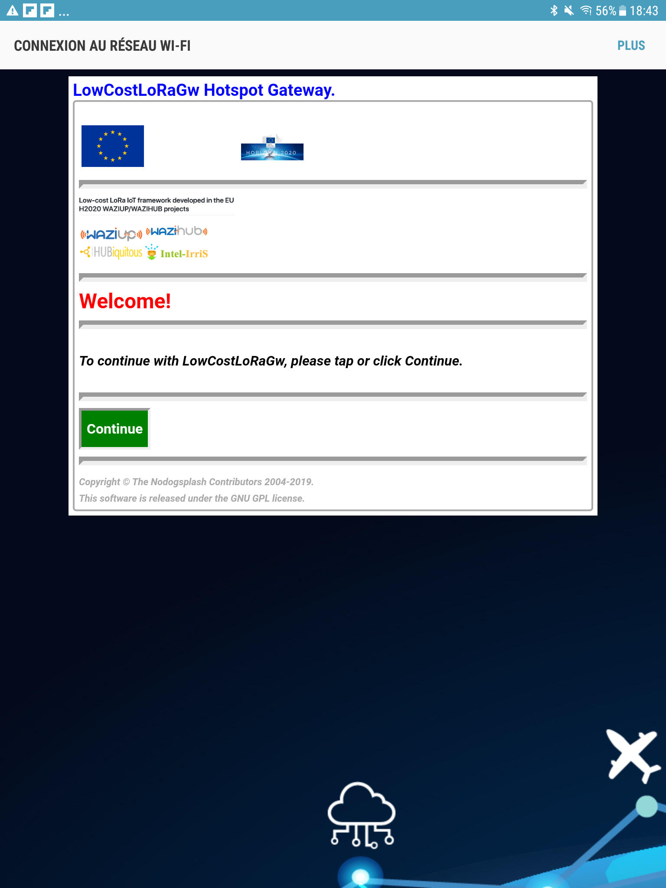

Captive WiFi
============

If `nodogsplash` is not installed, install it with:

	> cd
	> cd Downloads
	> sudo apt install libmicrohttpd-dev
	> git clone https://github.com/nodogsplash/nodogsplash.git
	> cd nodogsplash
	> make
	> sudo make install

Then update the LowCostLoRa gateway distribution. That will install the `lora_gateway/splash` folder and content.

	> cd
	> cd lora_gateway/scripts
	> sudo ./update_gw.sh
	
Then, install the specific `nodogsplash` configuration:

	> cd
	> cd lora_gateway/splash
	> ./install.sh
	
Once installed, use a smartphone or tablet to connect to the gateway's WiFi. You should see the captive portal allowing you to go directly to the sensor data web page (default behavior, see below to change the landing page).

To change the logo pictures, edit `splash/splash.html`.

To change the background image, edit `splash/splash.css`.

To change the project name (e.g. LowCostLoRaGw), edit `nodogsplash.conf` and change `GatewayName` parameter. Then run `install.sh` again.

To change the landing page, edit `nodogsplash.conf` and change `RedirectURL` parameter. Then run `install.sh` again.

Refer to the [`nodogsplash`'s documentation](https://nodogsplashdocs.readthedocs.io/_/downloads/en/stable/pdf/) for more details.

Enjoy!
C. Pham		